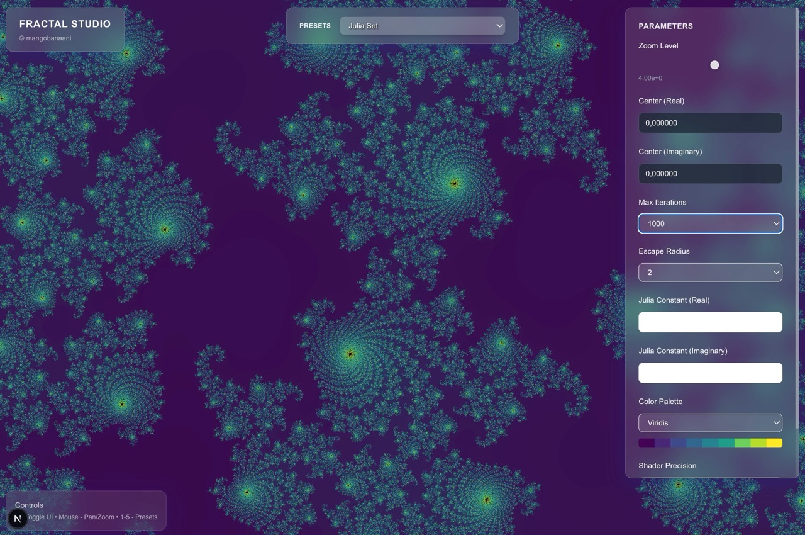
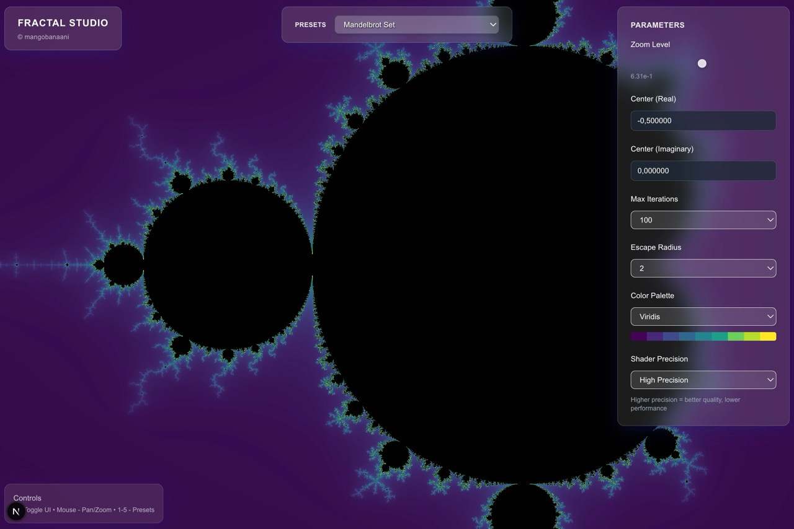
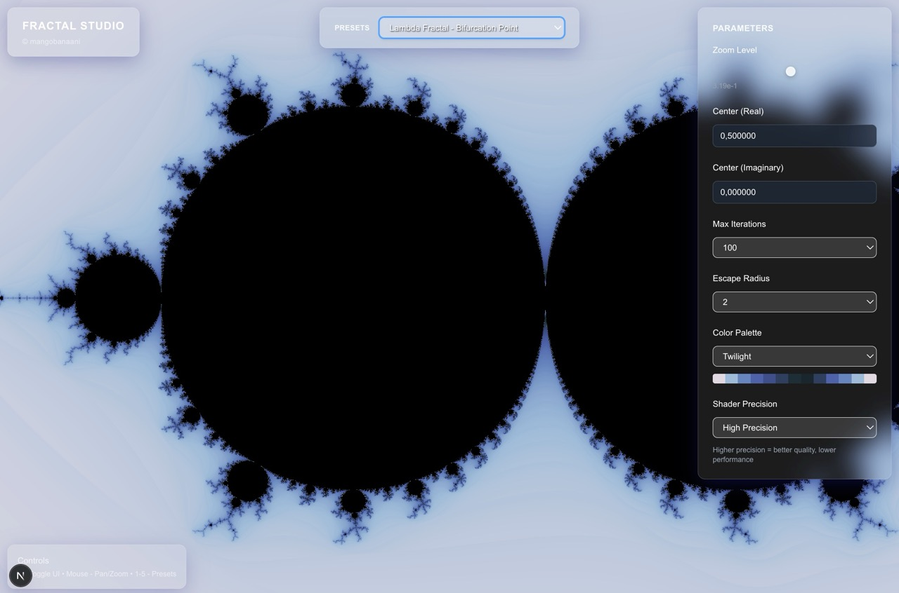

# Fractal Studio

A high-performance, GPU-accelerated fractal explorer built with Next.js 15, WebGL 2.0, and TypeScript. Features real-time rendering at 60FPS with advanced optimization techniques including triple buffering, adaptive quality, and Web Workers.

## Gallery

<div align="center">

### Mandelbrot Set


### Julia Set


### Burning Ship Fractal


</div>

Copyright (c) mangobanaani

## Features

### Core Technical Features
- **WebGL 2.0 Rendering Pipeline** with OffscreenCanvas support
- **Triple Buffering** implementation to prevent rendering stalls
- **Precision Control**: User-selectable highp/mediump/lowp shader precision
- **Shader Hot-Reloading** during development with dynamic GLSL import
- **Performance Optimizations**:
  - Debounced parameter updates for smooth interactions
  - Level-of-Detail (LOD) system for adaptive quality
  - Web Workers for fractal computation and color palette generation
  - Automatic performance monitoring and optimization suggestions

### Fractal Types
- **Mandelbrot Set** - The classic fractal with infinite detail
- **Julia Sets** - Beautiful connected/disconnected fractals with customizable constants
- **Burning Ship** - Ship-like fractal with unique mathematical properties
- **Lyapunov Fractals** - Parameter space visualization of dynamical systems
- **Newton Fractals** - Root-finding algorithm visualizations
- **Tricorn** - Conjugate Mandelbrot variations
- **Celtic Mandelbrot** - Modified Mandelbrot with absolute value operations
- **Perpendicular Mandelbrot** - Alternative Mandelbrot variant
- **Heart Fractal** - Heart-shaped mathematical art
- **Phoenix Fractal** - Recursive fractal with unique dynamics
- **Lambda Fractal** - Parameter-driven complex dynamics

### Advanced Rendering
- **Multiple Color Palettes**: Viridis, Plasma, Inferno, Magma, Cividis, Twilight, Ocean, Fire, Rainbow, Electric
- **Smooth Coloring**: Continuous iteration counts for seamless gradients
- **Anti-aliasing**: High-quality rendering with precision control

### Interactive Controls
- **Glassmorphism UI**: Modern frosted glass interface design
- **Touch/Mouse Support**: Pan with drag, zoom with wheel/pinch
- **Keyboard Shortcuts**: Quick preset switching (1-5), controls toggle (H), reset (R)
- **Real-time Parameters**: Zoom, center, iterations, escape radius, Julia constants

## Getting Started

### Prerequisites
- Node.js 18+ 
- Modern browser with WebGL 2.0 support
- TypeScript knowledge for development

### Installation

```bash
# Clone the repository
git clone https://github.com/yourusername/fractal-studio.git
cd fractal-studio

# Install dependencies
npm install

# Start development server
npm run dev
```

Open [http://localhost:3000](http://localhost:3000) in your browser.

### Development Commands

```bash
# Development with hot reload
npm run dev

# Production build
npm run build
npm run start

# Testing
npm run test           # Unit tests with Jest
npm run test:watch     # Watch mode for development
npm run test:coverage  # Generate coverage report

# Code quality
npm run lint           # ESLint checking
```

## Usage

### Basic Navigation
- **Pan**: Click and drag or touch and drag
- **Zoom**: Mouse wheel or pinch gesture
- **Reset View**: Press R or click preset button
- **Toggle Controls**: Press H key

### Keyboard Shortcuts
- `1-5`: Switch between fractal presets
- `H`: Toggle UI controls visibility
- `R`: Reset to preset defaults

### Advanced Parameters

#### Mandelbrot Set
- **Center**: Complex coordinate to focus on
- **Zoom**: Magnification level (0.001 to 1000)
- **Max Iterations**: Quality vs performance trade-off (50-1000)
- **Escape Radius**: Mathematical boundary (2, 4, or 8)

#### Julia Sets
- **Julia Constant**: Real and imaginary components defining the fractal shape
- Famous constants included:
  - Classic Dragon: -0.7269 + 0.1889i
  - Douady Rabbit: -0.123 + 0.745i
  - Lightning: -0.8 + 0.156i

#### Performance Settings
- **Shader Precision**: Balance quality vs performance
  - `highp`: Best quality, slower on some devices
  - `mediump`: Good balance for most devices  
  - `lowp`: Fastest rendering, lower quality

## Architecture

### Project Structure
```
src/
├── components/          # React UI components
│   ├── FractalStudio.tsx   # Main application component
│   ├── ParameterControls.tsx
│   └── PresetSelector.tsx
├── lib/                 # Core libraries
│   ├── webgl/              # WebGL rendering engine
│   │   └── shaders.ts
│   ├── fractals/           # Modular fractal definitions
│   │   ├── base.ts
│   │   ├── mandelbrot.ts
│   │   ├── julia.ts
│   │   └── loader.ts
│   ├── fractal-renderer.ts # Main renderer class
│   ├── fractal-presets-modular.ts # Fractal definitions
│   └── color-palettes.ts   # Color systems
├── types/               # TypeScript definitions
│   └── fractal.ts
└── __tests__/          # Unit tests
    └── fractal-presets.test.ts
```

```typescript
### Key Classes

#### FractalRenderer
Main rendering engine managing WebGL context, shaders, and frame rendering.

```typescript
const renderer = new FractalRenderer(canvas, {
  escapeRadius: 2,
  maxIterations: 100,
  center: { real: -0.5, imag: 0.0 },
  zoom: 4.0,
  colorPalette: 'viridis',
  precision: 'highp'
});

renderer.startRenderLoop();
```

## Testing

### Unit Tests (Jest)
Tests for mathematical functions, parameter validation, and utility functions.

```bash
# Run specific test suites
npm test fractal-presets

# Watch mode during development
npm run test:watch

# Generate coverage report
npm run test:coverage
```

Key test areas:
- Fractal parameter validation and edge cases
- Color palette generation and interpolation
- Mathematical precision and NaN protection

## Performance Optimization

### Target Metrics
- **First Render**: < 200ms on desktop
- **Pan/Zoom Latency**: < 16ms (60FPS target)
- **Frame Consistency**: 90%+ frames within 16.7ms

### GPU-Level Optimizations
1. **Triple Buffering**: Prevents GPU pipeline stalls
2. **Shader Optimization**: Minimized ALU operations and texture lookups
3. **Precision Management**: Selective highp usage for critical calculations
4. **Context Management**: Graceful WebGL context loss recovery

### Performance Monitoring
Real-time performance metrics with optimization suggestions:

```typescript
const report = performanceMonitor.getPerformanceReport();
// {
//   averageFPS: 59.2,
//   performanceGrade: 'A',
//   recommendations: ['Can increase max iterations']
// }
```

## Color Systems

### Built-in Palettes
- **Scientific**: Viridis, Plasma, Inferno, Magma, Cividis
- **Artistic**: Twilight, Ocean, Fire, Rainbow, Electric

### Custom Palette Creation
```typescript
const customPalette = createCustomPalette('sunset', [
  '#ff0000', '#ff8000', '#ffff00', '#ff4000'
], 'linear');
```

## API Reference

### Core Types
```typescript
interface FractalParams {
  escapeRadius: 2 | 4 | 8;
  maxIterations: 50 | 100 | 500 | 1000;
  center: Complex;
  zoom: number;
  colorPalette: string;
  precision: 'highp' | 'mediump' | 'lowp';
  juliaConstant?: Complex;
}

interface Complex {
  real: number;
  imag: number;
}
```

### Main Classes
- `FractalRenderer`: Primary rendering engine
- `FractalStudio`: Main React component
- `ColorUtils`: Color space conversion and palette generation

## Troubleshooting

### Common Issues

#### WebGL Not Supported
```javascript
// Check WebGL support
const canvas = document.createElement('canvas');
const gl = canvas.getContext('webgl2');
if (!gl) {
  console.error('WebGL 2.0 not supported');
}
```

#### Poor Performance
1. Reduce max iterations (100 → 50)
2. Lower shader precision (highp → mediump)
3. Close other GPU-intensive applications

#### Context Loss
The application automatically handles WebGL context loss and restoration.

## License

MIT License - see LICENSE file for details.

## Acknowledgments

- WebGL specifications for technical reference
- Next.js team for the excellent React framework
- Scientific color palette designs

---

Built by mangobanaani for the mathematical art community
```

#### `WebGLContextManager`
Handles WebGL context creation, buffer management, and context loss recovery.

```typescript
const contextManager = new WebGLContextManager(canvas, {
  type: 'triple',
  swapStrategy: 'discard',
  width: 800,
  height: 600
}, {
  powerPreference: 'high-performance'
});
```

#### `PerformanceMonitor`
Tracks rendering performance and provides optimization recommendations.

```typescript
performanceMonitor.startFrame();
// ... rendering code ...
performanceMonitor.endFrame();

const metrics = performanceMonitor.getMetrics();
const lodLevel = performanceMonitor.getRecommendedLOD(zoomLevel);
```

## Testing

### Unit Tests (Jest)
Tests for mathematical functions, parameter validation, and utility functions.

```bash
# Run specific test suites
npm test fractal-presets
npm test color-palettes

# Watch mode during development
npm run test:watch

# Generate coverage report
npm run test:coverage
```

Key test areas:
- Fractal parameter validation and edge cases
- Color palette generation and interpolation
- WebGL context mocking and error handling
- Mathematical precision and NaN protection

### E2E Tests (Playwright)
Cross-browser testing for user interactions and visual regression.

```bash
# Run E2E tests
npm run test:e2e

# Interactive test runner
npm run test:e2e:ui

# Run on specific browser
npx playwright test --project=chromium
```

Test coverage includes:
- Fractal rendering and preset switching
- Interactive controls (zoom, pan, parameters)
- Performance monitoring and optimization
- Touch/mobile interactions
- Keyboard shortcuts and accessibility

### Performance Benchmarks
Automated performance testing ensures 60FPS target:

```typescript
test('maintains 60FPS during zoom operations', async ({ page }) => {
  // Performance testing implementation
  const fps = await measureFPS(page);
  expect(fps).toBeGreaterThan(58);
});
```

## Performance Optimization

### Target Metrics
- **First Render**: < 200ms on desktop
- **Pan/Zoom Latency**: < 16ms (60FPS target)
- **Frame Consistency**: 90%+ frames within 16.7ms

### Optimization Techniques

#### GPU-Level Optimizations
1. **Triple Buffering**: Eliminates frame drops during complex renders
2. **Precision Scaling**: Adaptive shader precision based on zoom level
3. **Texture Streaming**: Efficient color palette management
4. **Context Management**: Graceful WebGL context loss recovery

#### CPU-Level Optimizations
1. **Debounced Updates**: Batched parameter changes prevent render stalls
2. **Web Workers**: Background computation for heavy calculations
3. **LOD System**: Automatic quality reduction during interaction
4. **Memory Management**: Efficient buffer allocation and cleanup

#### User Experience Optimizations
1. **Progressive Loading**: Show low-quality preview while rendering
2. **Adaptive UI**: Performance-based feature enabling/disabling
3. **Touch Optimization**: Native gesture recognition
4. **Accessibility**: Keyboard navigation and screen reader support

### Performance Monitoring
Real-time performance metrics with optimization suggestions:

```typescript
const report = performanceMonitor.getPerformanceReport();
// {
//   averageFPS: 59.2,
//   performanceGrade: 'A',
//   recommendations: ['Can increase max iterations']
// }
```

## Color Systems

### Built-in Palettes
- **Scientific**: Viridis, Plasma, Inferno, Magma, Cividis
- **Artistic**: Twilight, Ocean, Fire, Rainbow, Electric

### Custom Palette Creation
```typescript
const customPalette = createCustomPalette('sunset', [
  '#ff0000', '#ff8000', '#ffff00', '#ff4000'
], 'linear');
```

### Color Space Support
- **RGB**: Standard computer graphics
- **HSL**: Hue-saturation-lightness for intuitive control
- **CIE LAB**: Perceptually uniform color gradients

## Configuration

### Environment Variables
```bash
# Optional: Analytics and monitoring
NEXT_PUBLIC_ANALYTICS_ID=your_analytics_id

# Optional: Performance monitoring service
NEXT_PUBLIC_PERFORMANCE_API=your_performance_endpoint
```

### Build Configuration
Optimized for production deployment:

```javascript
// next.config.js
module.exports = {
  experimental: {
    typedRoutes: true,
  },
  compiler: {
    removeConsole: process.env.NODE_ENV === 'production',
  },
};
```

## Deployment

### Vercel (Recommended)
```bash
# Install Vercel CLI
npm i -g vercel

# Deploy
vercel --prod
```

### Docker
```bash
# Build image
docker build -t fractal-studio .

# Run container
docker run -p 3000:3000 fractal-studio
```

### Static Export
```bash
# Generate static files
npm run build
npm run export
```

## Contributing

### Development Setup
1. Fork the repository
2. Create feature branch: `git checkout -b feature/amazing-feature`
3. Install dependencies: `npm install`
4. Start development: `npm run dev`
5. Run tests: `npm run test:all`

### Code Standards
- **TypeScript**: Strict mode, no `any` types
- **ESLint**: Airbnb configuration with custom rules
- **Prettier**: Automatic code formatting
- **Test Coverage**: 90%+ branch coverage required

### Performance Requirements
- All features must maintain 60FPS on mid-range hardware
- WebGL fallbacks for unsupported devices
- Progressive enhancement for advanced features

## API Reference

### Core Types
```typescript
interface FractalParams {
  escapeRadius: 2 | 4 | 8;
  maxIterations: 50 | 100 | 500 | 1000;
  center: Complex;
  zoom: number;
  colorPalette: string;
  precision: 'highp' | 'mediump' | 'lowp';
  juliaConstant?: Complex;
}

interface Complex {
  real: number;
  imag: number;
}
```

### Main Classes
- `FractalRenderer`: Primary rendering engine
- `WebGLContextManager`: WebGL context and buffer management
- `PerformanceMonitor`: Performance tracking and optimization
- `ColorUtils`: Color space conversion and palette generation

## Troubleshooting

### Common Issues

#### WebGL Not Supported
```javascript
// Check WebGL support
const canvas = document.createElement('canvas');
const gl = canvas.getContext('webgl2');
if (!gl) {
  console.error('WebGL 2.0 not supported');
}
```

#### Poor Performance
1. Reduce max iterations (100 → 50)
2. Lower shader precision (highp → mediump)
3. Enable adaptive quality
4. Close other GPU-intensive applications

#### Context Loss
The application automatically handles WebGL context loss and restoration.

### Debug Mode
```bash
# Enable debug logging
DEBUG=fractal:* npm run dev
```

## License

MIT License - see [LICENSE](LICENSE) file for details.

## Acknowledgments

- [Three.js](https://threejs.org/) for 3D math utilities
- [matplotlib](https://matplotlib.org/) for color palette inspiration  
- [WebGL specifications](https://www.khronos.org/webgl/) for technical reference
- [Next.js team](https://nextjs.org/) for the excellent React framework

---

Built by mangobanaani for the mathematical art community
